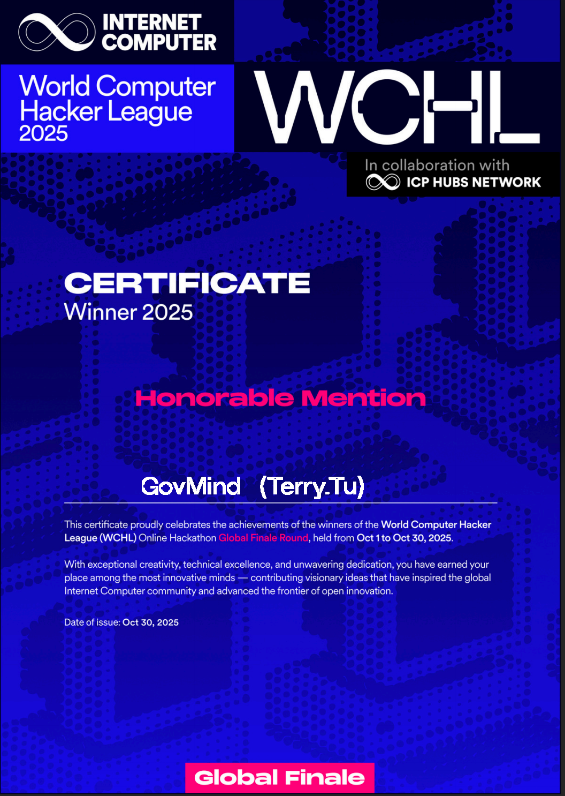

### Hi there 👋 Know more about me 😄

Hello, I'm Terry Tu, delighted to make your acquaintance!

Greetings to all! I bring over a decade of experience as a backend developer, with a dedicated focus on web3 development for the past 5 years, making for an exhilarating journey.

My enthusiasm lies deeply in the crypto space and everything connected to decentralized technologies. Engaging with blockchain, smart contracts, and decentralized applications (DApps) has been an exciting adventure for me. I am continually delving into inventive solutions, pushing the limits of what can be achieved.

### Technology Stack

**Languages**

Dedicate yourself completely to everything you love.

### 📜 Certificate

